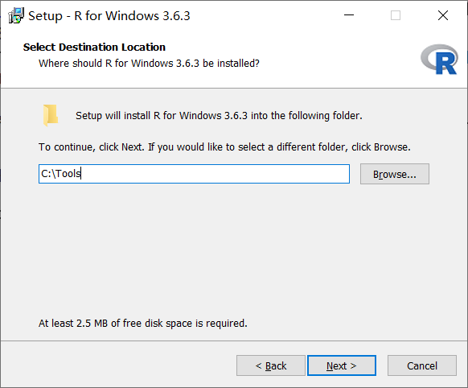
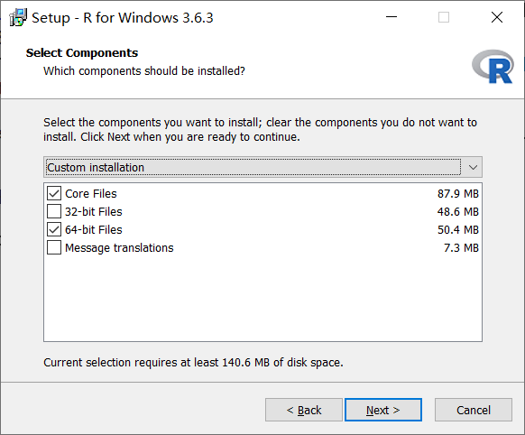
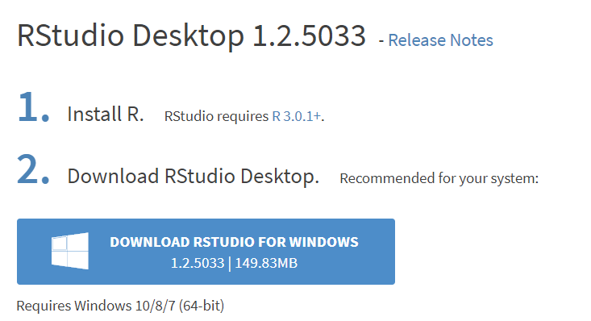
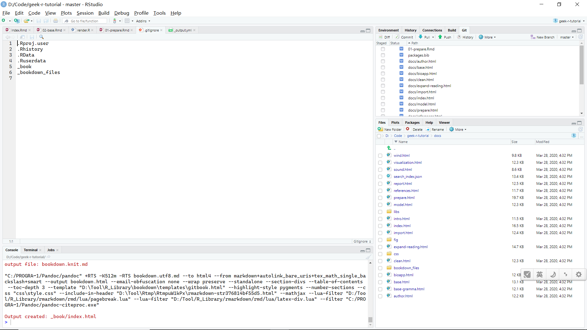
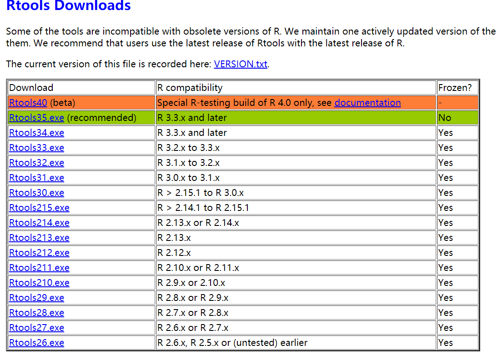
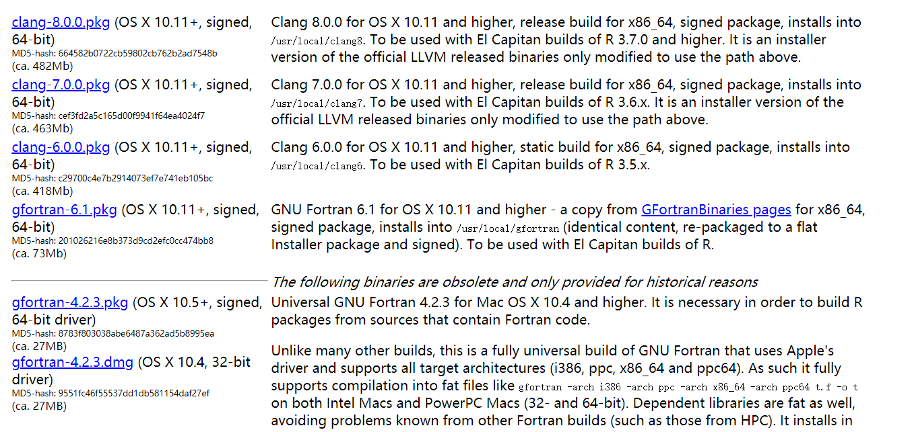

\mainmatter

# 准备工作 {#prepare}

想要在本地计算机上运行 R 语言代码，读者需要安装 R。为了方便 R 语言环境的使用和代码编写，我推荐读者使用 RStudio 公司开发的 R 集成开发环境（IDE）RStudio。

如果读者已经在计算机上安装好 R 和 RStudio，可以跳过本节内容。

如果读者倾向于使用像 VS Code 和 Idea 这样的流行编辑器，请自行安装对应的 R 语言拓展插件。

## R 的下载和安装

点击链接 <https://mirrors.tuna.tsinghua.edu.cn/CRAN/> 进入 CRAN 的清华镜像源，选择与自己操作系统对应的 R 进行下载。

- Windows 系统用户进入 [base 子目录](https://mirrors.tuna.tsinghua.edu.cn/CRAN/)，点击 **Download R x.x.x for Windows**。
- MacOS 系统用户通过镜像地址进入 **R for Mac OS X** 页面后，点击 `R-x.x.x.pkg` 进行下载。
- Linux 系统发行版众多，且需要一些额外的技术知识，请相应用户请阅读本章【**常见问题与方案**】一节学习 R 在 Linux 发行版下的安装。

> 上述的 `x.x.x` 指代 R 的版本号，目前是 `3.6.3`（2020-03），以用户下载时的实际版本号为准。

对于 MacOS 系统用户，下载后直接双击一路向下进行傻瓜式操作即可安装成功。

对于 Windows 系统用户，根据笔者几年的安装和使用经验，安装时有一些额外的注意事项：

1. Windows 一般包含多个盘符，请读者尽量不要将 R 安装在 `Program files` 这样有空格的目录或中文目录下。读者可以自行创建一个专门的工具用于安装 R 以及放置 R 的三方包，如 `C:/Tools`，见图 \@ref(fig:set-install-path)。
2. 读者的电脑如果有 SSD 固态硬盘，最好将 R 安装到固态硬盘目录里，因为读写数据快。
3. 一般现在电脑是 64 位的，如果你确定是这样，在安装时有关于 32 位的选项都可以不勾选，如图 \@ref(fig:select-64bit)。
4. 如果涉及到添加环境变量/路径之类的步骤，勾选添加即可。
5. 以上没提到的，一路点下一步。

```{r set-install-path, fig.align="center", echo=FALSE, fig.cap="设置安装路径"}

```

```{r select-64bit, fig.align="center", echo=FALSE, fig.cap="只选择 64 位"}

```

在 Windows 或 MacOS 下读者如果想要安装含有像 C++ 这样的源码的包，需要安装编译工具如 g++，这些编译工具都被 R 语言团队打包成了 Rtools，如果读者有这方面的需求，请阅读本章【**常见问题与方案**】一节学习 Rtools 的安装。

## RStudio 的下载和安装

点击链接 <https://rstudio.com/products/rstudio/download/> 进入 RStudio 下载界面，根据自己的操作系统选择适合的安装文件进行安装即可，如图 \@ref(fig:install-rstudio)。

```{r install-rstudio, fig.align="center", echo=FALSE, fig.cap="下载 RStudio"}

```

RStudio 的安装非常简单，没有特别的注意事项，读者可以直接一路点击向下。另外，读者可以自定义 RStudio 的安装路径，这不会影响 R 的使用。


RStudio 安装完成后可以像普通软件一样搜索和双击打开，如图 \@ref(fig:rstudio-overview)。

```{r rstudio-overview, fig.align="center", echo=FALSE, fig.cap="RStudio 界面"}

```

下面对 RStudio 的界面进行简单介绍，读者在后续的使用中将会逐渐熟悉。

- 最上方是菜单栏，所有的功能都可以通过它们找到，没事可以多点一点。
- 左上方是代码编辑窗口，平时写代码的地方。
- 左下方是 R 控制台（还有终端和任务设定），我们可以通过控制台键入命令并观察 R 的输出（在代码编辑窗口中通过 Ctrl + Enter 快捷键可以将光标行代码发送到控制台，**非常有用**）。
- 整个右方是一些辅助窗口，最重要的是右上方的环境 Environment 窗口（用于展示当前环境中的对象：包括变量、函数等）和下方的 5 个窗口：Files、Plots、Packages、Help 以及 Viewer。


## 配置（可选）

> 下面的说明针对的是 Windows 系统，但对于其他系统也可以进行类似的设定。

Windows 下的 R 默认使用用户文档目录作为家目录（等同于 Linux 中的`~`），使用系统指定的临时目录作为临时目录，使用安装路径下的 `R版本/library` 目录作为 R 包存储目录。

如果读者什么都选择默认的，

* 当你一时安装包过多，或者装了电脑管家之类的管理软件时，系统的临时目录经常会把 RStudio 锁死，导致不能进行读写。
* 当你想要更新 R 版本时，有时你不得不面临重装所有包的举动（如果你使用几个月，装了几百个包...），或者想其他办法解决。

下面介绍如何创建自定义的临时目录与包目录，这样上面情况都不会发生了。

读者在安装好 R 和 RStudio 后，打开 RStudio，在 R 控制台键入：

```r
file.edit("~/.Rprofile")
```

在启动RStudio时，RStudio会首先执行里面的 R 代码，所以我们可以在这里用 R 代码进行配置。

首先在该文档内添加内容：

```r
#--------------------------------------------
# Set custom library and temp directory for R
# NOTE: please only change following 2 paths
#   Any Question, please email to 
#       Shixiang Wang <w_shixiang@163.com>
#--------------------------------------------
.CUSTOM_LIB = "C:/Tools/R/R_Library" # set your custom library location
.TMP = "C:/Tools/R/Rtmp"             # set a temp dir for R running
                                     # please do not add '/' at the end !!!

if(!dir.exists(.CUSTOM_LIB)){
    dir.create(.CUSTOM_LIB, recursive = TRUE)
}

.libPaths(c(.CUSTOM_LIB, .libPaths()))
message("Using library: ", .libPaths()[1])


if(dirname(tempdir()) != .TMP){
    if(!dir.exists(.TMP)) dir.create(.TMP, recursive = TRUE)
    cat(paste0("TMPDIR = ", .TMP), file="~/.Renviron", sep = "\n")
}
message("Using temp directory: ", .TMP)

#---------------------------------------------------
# pacman is optional, you can delete following code
# If you wanna use pacman, please read:
#   <https://www.jianshu.com/p/cb16ded75672>
# Basically, 
# #1, you can use 'p_load' to load multiple package into R
#       like p_load(data.table, dplyr)
# #2, you can use 'p_get' just to install package
# #3, you can use 'p_update' to update all packages
#---------------------------------------------------
if(!require(pacman)){
    install.packages("pacman", dependencies = TRUE)
}
library(pacman)
#----------------------------------------------------
```

然后根据情况对上述内容中的目录设定进行修改即可。

```r
.CUSTOM_LIB = "C:/Tools/R/R_Library" # set your custom library location
.TMP = "C:/Tools/R/Rtmp"             # set a temp dir for R running
                                     # please do not add '/' at the end !!!
```

**pacman** 那段代码是可选的，该包是 `library()` 函数的替代品，使用它安装和管理 R 包更简单。具体的使用方法可以[点击阅读](https://www.jianshu.com/p/cb16ded75672)我之前的简书文章。

这里为了方便大家使用，我添加了一些必要注释，如果上述配置存在问题，读者可以发邮件给我。

保存后重启 RStudio 或者点击菜单栏 **Session** 下的 **Restart R**。

以后 RStudio 每次启动后都会输出读者计算机中 R 包的存储路径和它使用的临时路径。读者如果以后升级 R，只要重装下 R 安装文件就可以了，R 包的目录并不会改动，键入下面的命令可以更新所有的 R 包：

```r
p_update()
```


## 常见问题与方案

除了本节目前罗列的问题，读者在学习本章内容时遇到的其他问题都可以通过 [GitHub Issue](https://github.com/ShixiangWang/geek-r-tutorial/issues) 提出和进行讨论。如果读者提出的是通性问题，将增补到该节。

### R 在 Linux 系统下的安装

#### Ubuntu 从源安装 R

下述操作基于在 Ubuntu 18 系统上安装 R 3.5 的实践。

> `$` 前缀指明命令在 `shell` 终端中进行。

安装依赖：

```sh
$ sudo apt-get install xorg-dev libreadline-dev
$ sudo apt-get install libcurl4-openssl-dev
$ sudo apt-get install libbz2-dev
$ sudo apt-get install libcairo2-dev libgtk2.0-dev
$ sudo apt-get install texinfo texlive
$ wget http://mirrors.ctan.org/fonts/inconsolata.zip
$ sudo cp -Rfp inconsolata/* /usr/share/texmf/
$ # 或者 sudo cp -r inconsolata/ /usr/share/texlive/texmf-dist/tex/latex/
$ sudo mktexlsr # 刷新

# 如果没有java解释器，安装下
$ sudo apt-get install default-jdk
```

下载与安装 R：

```sh
$ curl -O http://cran.utstat.utoronto.ca/src/base/R-3/R-3.5.0.tar.gz
$ tar -zxvf R-3.5.0.tar.gz
$ cd R-3.5.0/
$  ./configure --prefix=$HOME/local/R --enable-R-shlib --with-cairo=yes
$ # ./configure --with-cairo --with-libpng --with-libtiff --with-jpeglib --enable-R-shlib --prefix=$HOME/local/R
$ make
$ make install
```

创建符号链接：

```sh
$ cd /usr/bin/
$ sudo ln -s $HOME/local/R/bin/Rscript Rscript
$ sudo ln -s $HOME/local/R/bin/R R
```

检查：

```sh
$ ls -l R*
lrwxrwxrwx 1 root root 23 6月  28 17:01 R -> /home/wsx/local/R/bin/R
lrwxrwxrwx 1 root root 29 6月  28 17:01 Rscript -> /home/wsx/local/R/bin/Rscript
```

使用：

```sh
$ R

R version 3.5.0 (2018-04-23) -- "Joy in Playing"
Copyright (C) 2018 The R Foundation for Statistical Computing
Platform: x86_64-pc-linux-gnu (64-bit)

R is free software and comes with ABSOLUTELY NO WARRANTY.
You are welcome to redistribute it under certain conditions.
Type 'license()' or 'licence()' for distribution details.

  Natural language support but running in an English locale

R is a collaborative project with many contributors.
Type 'contributors()' for more information and
'citation()' on how to cite R or R packages in publications.

Type 'demo()' for some demos, 'help()' for on-line help, or
'help.start()' for an HTML browser interface to help.
Type 'q()' to quit R.

> 

```

如果遇到编译问题和报错，读者可以参考下面两篇博文：

* [ubuntu 上安装 R 的时候遇到的问题总结](https://www.cnblogs.com/wing1995/p/4635371.html)
* [CentOS 下 R 的安装](http://m.blog.itpub.net/9036/viewspace-2122686/)


#### CentOS 从源安装 R


下述操作基于在 CentOS 系统上安装 R 3.6 的实践。

> `$` 前缀指明命令在 `shell` 终端中进行。

首先切入 root 账户。

安装 R 编译依赖：

```sh
$ yum-builddep R
```

消灭界面configure警告：`configure: WARNING: neither inconsolata.sty nor zi4.sty found: PDF vignettes and package manuals will not be rendered optimally`

```sh
$ wget http://mirrors.ctan.org/fonts/inconsolata.zip
$ Unzip inconsolata.zip 
$ cp -Rfp inconsolata/* /usr/share/texmf/
$ mktexlsr
```

下载 R 并解压：

```sh
$ wget -c https://cran.r-project.org/src/base/R-3/R-3.6.0.tar.gz
$ tar zxvf R-3.6.0.tar.gz 
```

编译安装

```sh
$ cd R-3.6.0/
$ ./configure --prefix=/home/public/R/R-base --enable-R-shlib --with-cairo=yes
```

这里 `prefix` 后面的路径可以自己指定。

然后

```sh
$ make
$ make install
```

最后可以把它链接到常用软件位置上去。

```sh
$ sudo ln -s /home/public/R/R-basebin/R /bin/R 
```


### Rtools 安装

#### Windows 系统 Rtools

点击链接 <https://mirrors.tuna.tsinghua.edu.cn/CRAN/> 进入 CRAN 页面，依次点击【Download R for Windows】、【Rtools】，然后选择推荐的版本下载和安装，如图 \@ref(fig:rtools-win)。


```{r rtools-win, fig.align="center", echo=FALSE, fig.cap="Windows 下 Rtools 的下载"}

```

安装时一路点击向下，建议不要修改安装路径，因为 R 的很多编译环境变量设定都指向默认的安装路径，读者如果修改它后续很可能引起不必要的麻烦。

#### MacOS 系统 Rtools

点击链接 <https://mirrors.tuna.tsinghua.edu.cn/CRAN/> 进入 CRAN 页面，依次点击【Download R for Mac OS X】、【tools】，然后选择最新版的 `clang-x.x.x.pkg` 和 `gfortran-x.x.x.pkg` 下载和安装即可，如图 \@ref(fig:rtools-mac)。

> `x.x.x` 指代版本号，如 `8.0.0`。


```{r rtools-mac, fig.align="center", echo=FALSE, fig.cap="MacOS 下 Rtools 的下载"}

```

### RStudio Server 安装

RStudio Server 比较好用，适用于安装在小型服务器上以方便多人同时利用服务器的计算资源。需要注意，RStudio Server 的安装需要管理员（root）权限。

点击链接 <https://rstudio.com/products/rstudio/download-server/> 进入 RStudio Server 下载页面，针对不同的 Linux 发行版，RStudio 公司已经有良好的文档支持，所以我不再赘述。

在使用 RStudio Server 时我有一个小小的建议，如我在前面的配置一节所说，读者可以自己创建一个专门的目录管理所有的 R 包。并且针对该目录，建议新建一个 Linux 群组以管理它的访问权限。

这里简介一下安装后添加其他人，以增加用户 rotation 为例：

```sh
$ sudo useradd rotation -d /home/rotation -m -g wsx   # 将新增用户添加到你所在群组
$ sudo passwd rotation                                # 设定初始密码 
$ sudo adduser rotation sudo                          # 给用户添加sudo权限，以方便一些操作
```